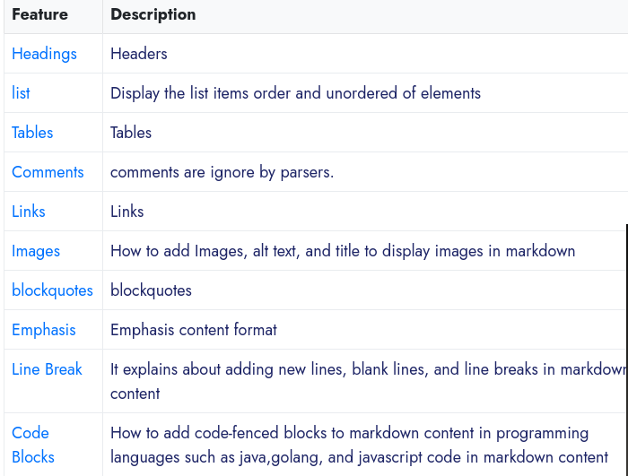

## Overview

1. **What is markdown?**

Markdown is an open-source markup language created by John Gruber. It contains plain text that has been formatted and is readable using specific syntax before being converted to HTML.

It is simple and easy to learn.

It helps users to write plain text and convert it to multiple formats like HTML, pdf, etc.

        Markdown is a lightweight markup language with plain text formatting syntax.

It contains two things

    Writing text content with special syntax
    Parser to convert this content into different output It helps developers and content writers to learn markdown.

2. **What is Markdown File Extension?**

There is no office extension defined for these types of files.

We can create a plain text file with the .md extension to write content for websites.

We can create a file with different extensions for markdown files

    .markdown
    .md
    .mkd
    .mkdown
    .text
    .mdown
    
Some of the popular vendors use HTML extensions.

GitHub uses markdown and mdown extensions.

GitHub uses the standard file extension as .md.

3. **Advantages**

    It is easy to read and write plain text that converts to a Rich HTML document.
    Easy to learn and write content effectively for technical and non-technical people.
    Easy to test the content locally and easy to add/update and delete content
    Support for popular visual editors
    Extending syntax to provide custom elements like audio, video, etc.
    easily share this content between different devices.
    Markdown is standard for writing content on GitHub, GitLab, and Reddit.
    
4. **Features**
    The list of features is provided as the basic syntax and extended syntax.
    version control systems**
    
    
*Figure 4. feauters

5. **text/markdown**

and request contains the below value for markdown data sending over the internet

Content-type : text/markdown

The default charset of text content type is ISO-8859-1 So UTF-8 is common charset for markdown.

In general, We used to set the below values for the general charset.

text/markdown; charset=UTF-8

RFC also adds a variant for markdown as seen below

text/markdown; charset=UTF-8; variant=Common

A variant can be Common, GFM, or CommonMark.

6. **What is markdown used for?**

It is text content written in text format written by Content writers and converts into different formats like HTML pdf.

Input is plainly readable text with a special syntax, and the application converts to a different format, Output is HTML, PDF, or word. These can be created and written with any popular text editor. These are used in many ways such as

    Writing content in static generators and generating HTML content
    Can also be used in Slack for communicating with users with this special syntax
    Jira content can include this syntax for HTML elements

writers, publishers, and academics to write content to publish to blogs and articles on web pages and also shared across different devices with pdf format.

7. **How do you open markdown files?**

These files open in a simple text editor or Integrated Development editors like Visual Studio, Atom Sublime Text, Notepad++, and Intelli IDEA in Windows, UNIX, and MAC OS.

Basic editors provide only the capabilities to read and write without format and validation.

IDEs provide plugins following features.

    Auto or manual Format of the code
    Syntax highlights coloring
    Inline render of this content in HTML view
    Some plugins provide export to PDF and Documents Some characters escaped using angle bracket syntax.
