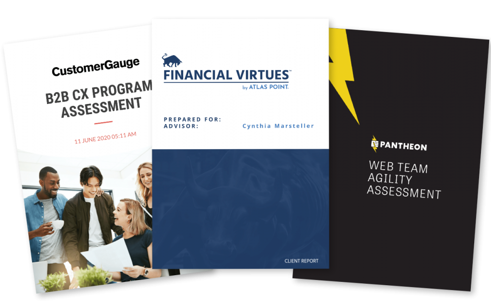

## Overview

1. **Use corporate branding to reflect your company**

You have the opportunity to connect with your audience and make sure they remember you. 

That’s why it’s important to build a good-looking, branded report, that stays true to your corporate identity. Moreover, when people read about themselves, they tend to be more interested. This means they’re always engaged just a little bit more. This is your opportunity to spotlight your brand.

You stay true to your corporate identity by following your brand style guidelines. This refers both to the visual guidelines, such as font, color pallet and logo, but also to your tone-of-voice, which can be commercial, informative, academic, etc.

*Reflections
2. **Personalize your report**

A very simple but effective way to engage with your respondent: address him/her personally in the report. 

You can test this principle for yourself in real-life situations: aren’t you more involved in a conversation when someone says your name? You’ll automatically pay more attention as from that moment. 

While designing a report, you can already start with the main title, e.g. “Sofie’s Personal Skills Report”. Some other examples:

*Main title

In order to make this possible, you’ll have to include variable content (name, scores, recommendations, …)  that enables you to address each different respondent that took the questionnaire. Not only on the first page, but also in the rest of the report. 

Talk to the reader, as if you were having a real-life conversation in which you explain what the findings of the test are.

Make personal recommendations: this motivates the reader to follow up on the report and reconsult it afterwards, or show it to colleagues or friends.

*Personal recommendations

3. **Keep style continuity from your survey**

When you read a survey-based report, you expect this report to be in the same format as the survey. Every survey is built using a certain style, colour combination and font. If the report following that survey suddenly looks completely different, there is a high chance respondents will lose attention, because they don’t see a connection with the survey they just filled out. So maintaining the style of the survey is key.

*Styles

Of course, you want your audience to have a pleasant experience reading about their personal results. It makes them connect with the subject, and even more so, with you. That’s why you need to keep them “in the zone” after they’ve finished the list of questions. 
 

Above, you can see an example of the last view you get after having taken this assessment. If you click the button “Download PDF”, you’ll get more details and recommendations for the future. As you can see, the same color pattern, font and style are maintained in both the survey as in the report. 

    
4. **Organize your report for readability**
    
Make sure your report is pleasant to read and easy to interpret. In a world where time is precious, readers should be able to understand the assessment results in the blink of an eye. 

The structure of your report is paramount: don’t make it too text-heavy. Use titles, summaries, charts and images to point out the most important insights. 

Make sure you have a classification that makes sense to the respondent. Bring structure in your report: discuss the results and present recommendations grouped together under a clear categorization:
 

    Create a clear structure by using headings and segment divisions. Preferably, every segment starts on a new page
    Put the headings and charts in a theme color
    Minimize dense walls of text: with more than 3-4 sentences of text you lose the attention of the reader
    Highlight the most important facts. Use a terminology that is in balance with your theme and subject

*Clear structure

5. **tUse colors that win**

The choice of colors influences the communication style of your report as well. 

Data is better retained when you apply vivid colors combined with high contrast. Your respondents will be able to digest the given information more easily when you combine a neutral color like black or grey with a bright color like red, blue, yellow or green to highlight titles, keywords or charts.
 

Associations are automatically made with certain colors. As already mentioned above, vivid colors get it done. They draw attention and keep the reader engaged. Each color represents different concepts or feelings:

*Colors

Red: this color is immediately related with the connotations “wrong” or “incorrect”. In a report, red might therefore be conveyed to be a bad color choice. However, red doesn’t always have to be a bad idea! It can also be associated with action, passion or determination.

 

Green: as opposed to red, green is often connected to positive growth or upward trends. Within a report, incorporating a green data point provides a trigger to evoke a positive experience.

 

Blue: a lot of brands use blue as their main color. Look at social media brands like Facebook, Twitter and LinkedIn, or large enterprise brands Samsung, BMW and P&G. The colour blue reflects professionality and interaction, and is related to a high rating or performance. 

 

Yellow: people tend to associate yellow with “okay” or “average”. It can also be related to happiness, a general good feeling. Because of the brightness of the color, yellow is also often associated with clarity and energy.

 

This is an interesting color guideline, but of course you need to consider your branding style and subject as well. You can also use variations of these colors, you don’t have to go for the brightest yellow or the “grassiest” green 😉 Just make sure your report is based on a theme color, and build the rest around it.

6. **Find balance between text and visuals**

Clutter smothers, simplicity breathes: make the results of your questionnaire easy to digest. If there is too much text, people tend to start reading diagonally and miss out on interesting insights. Instead, look for a balance between visuals like charts, diagrams or helpful images. We’ve already mentioned above how to design charts and select images for reports. 

There is no fixed rule or formula to determine the amount of visuals that a report should contain. For each report you’ll apply a different ratio. 2021 represents a highly visual era, so make sure there is at least a 50/50 balance between text and visuals to grab the attention of your reader. If insights can be presented visually, seize the opportunity to create charts and diagrams.

In general, the visuals should sum up the details of the results, while a short piece of text can accompany the visual by listing out the major takeaways.

*Modern report

Don’t use words if the same information can be presented visually. If there are titles, text segments or keywords that are essential to your report, you can underline them in a brand style color. 

*Bad example of report

